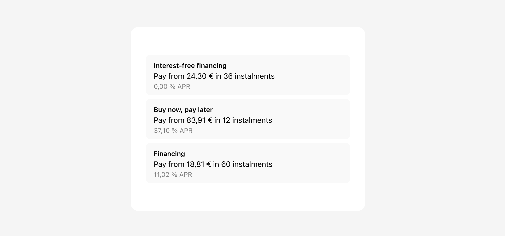

# Show payment method conditions

This example demonstrates how to display the payment method conditions using the `paymentMethods` and `paymentMethod` functions. This example uses the Nemuru checkout.js SDK to retrieve the available payment methods (`.paymentMethods`) and display each payment method conditions (`.paymentMethod`).



## Running the sample

1. Build the server

```shell
npm install
```

2. Run the server

```shell
npm run start
```

Make sure to inform the following variables with the values provided by Nemuru:

- `server.js`.
- `public/index.html`: set the `AGENT_ID`.

3. Go to [http://localhost:4000](http://localhost:4000)

## Prerequisites

Before you begin, ensure you have the following:

- Nemuru's API credentials (API username and password).
- An active point of sale (agent ID)
- A web server setup to serve your website.

## Step 1: Install Nemuru's checkout.js SDK

First, you need to install the Nemuru checkout.js SDK. You can do this by including the script directly in your HTML file (check the `public/index.html`).

```html
<!-- production -->
<script src="https://pay.nemuru.com/prod/checkout-js/checkout.js"></script>

<!-- staging -->
<script src="https://pay.nemuru.com/stg/checkout-js/checkout.js"></script>
```

## Step 2: Display available payment methods

Afterwards, initialize the Nemuru SDK (`await nemuru.init()`), and retrieve the available payment methods (`nemuru.paymentMethods()`). This will return a list of available payment methods that you can display to your customer based on the order amount supplied.

You can then display each payment method specific conditions (`nemuru.paymentMethod()`).

```javascript
const initialize = async () => {
  // Initialize Nemuru (ensure awaiting async promise)
  await nemuru.init(AGENT_ID);

  // Available payment methods
  const paymentMethods = nemuru.paymentMethods({ amount: 875 });

  // Display each payment method
  paymentMethods.forEach((paymentMethodType) => {
    mountPaymentMethod(paymentMethodType);
  });
};
```
