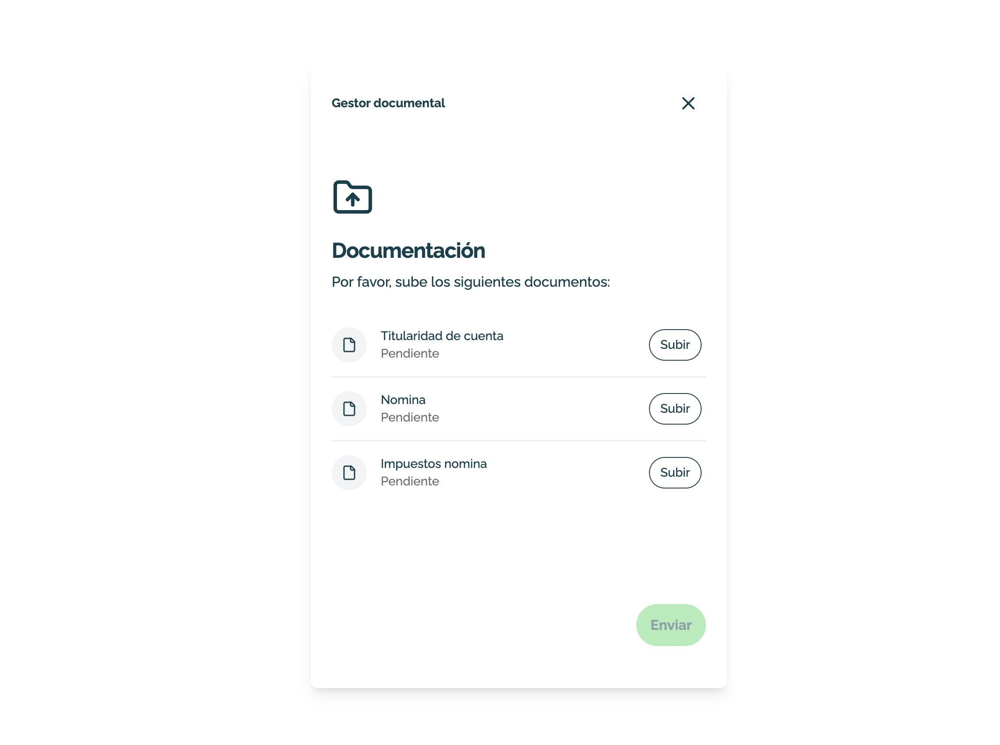

# Using Documentation component

This example demonstrates how mount Nemuru's Documentation component in your website. This is a pre-built component from Nemuru checkout.js SDK that will handle the documentation uploads of an existing checkout session.

This example assumes you have a checkout session client secret. If you don't have one, you can create a new checkout session using the [Create Checkout Session](https://docs.nemuru.com/checkout-session-embedded-api#operation/postCheckoutSession) endpoint.



## Running the sample

1. Build the server

```shell
npm install
```

2. Run the server

```shell
npm run start
```

Make sure to inform the following variables with the values provided by Nemuru:

- `server.js`: nothing to set.
- `public/index.html`: set the `AGENT_ID` and the `CHECKOUT_SESSION_CLIENT_SECRET`.

3. Go to [http://localhost:4000](http://localhost:4000)

## Prerequisites

Before you begin, ensure you have the following:

- Nemuru's API credentials (API username and password).
- An active point of sale (agent ID)
- A checkout session client secret.
- A web server setup to serve your website.

## Step 1: Install Nemuru's checkout.js SDK

First, you need to install the Nemuru checkout.js SDK. You can do this by including the script directly in your HTML file (check the `public/index.html`).

```html
<!-- production -->
<script src="https://pay.nemuru.com/prod/checkout-js/checkout.js"></script>

<!-- staging -->
<script src="https://pay.nemuru.com/stg/checkout-js/checkout.js"></script>
```

## Step 2: Mount the Documentation component

Provide valid values for the `AGENT_ID` and the `CLIENT_SECRET` in the `public/index.html` file.

Afterwards, initialize the Nemuru SDK (`await nemuru.init()`).

Then you can configure your Documentation component (`nemuru.documentation()`), and once set, you can mount it using its `.mount()` method.

```javascript
const mountDocumentationComponent = (clientSecret) => {
  // Configure component
  const documentation = nemuru.documentation({
    clientSecret,
    onLoaded: () => console.log("onLoaded"),
    onComplete: () => console.log("onComplete"),
    onClose: () => console.log("onClose"),
    onError: (error) => console.log("onError", error),
  });

  // Mount component
  documentation.mount("#nemuru-documentation");
};
```
